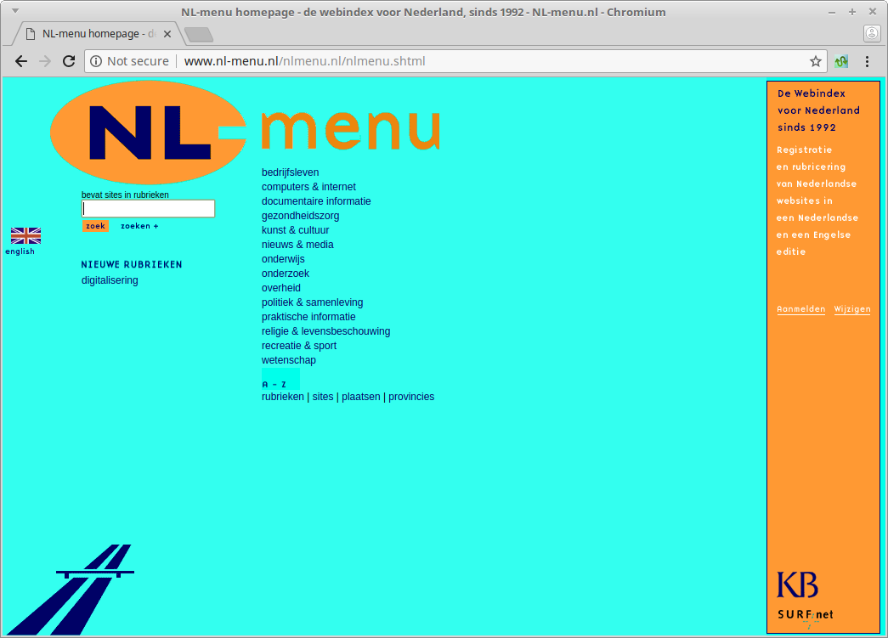

% Eerste Nederlandse webindex gered van CD-ROM
% Johan van der Knijff

De website *NL-menu* was de eerste Nederlandse webindex. *NL-menu* is in 1992 opgericht op initiatief van SURFnet, de Nederlandse universiteiten en de KB. Vanaf midden jaren '90 werd de site volledig door de KB beheerd. In 2004 stopte de KB met *NL-menu*, waarna de site offline is gehaald. De domeinnaam is hierna verkocht aan een bedrijf dat de naam gebruikte voor een (deels op op het oorspronkelijke *NL-menu* gebaseerde) webindex.

Het oorspronkelijke *NL-menu* is vervolgens in de vergetelheid geraakt. In het *Internet Archive* zijn nog wel restanten van *NL-menu* terug te vinden, maar deze zijn onvolledig. Omdat de KB pas in 2007 is begonnen met webarchivering, is *NL-menu* ook niet te vinden in het KB Webarchief. Wel zijn, kort voordat *NL-menu* in 2004 stopte, drie CD-ROMs gebrand met daarop de inhoud van de site.

*NL-menu* is van historisch belang, omdat het een unieke bron van informatie is over de (relatief) vroege geschiedenis van het Nederlandse web. We hebben daarom geprobeerd een reconstructie te maken van de site zoals deze er in het begin van 2004 bij lag. Het belangrijkste doel hiervan was om *NL-menu* met terugwerkende kracht in het KB webarchief te kunnen opnemen.

## Uitlezen van de CD-ROMs

De eerste stap hierbij was het uitlezen van de CD-ROMs. In eerste instantie leverden *alle* schijfjes hierbij leesfouten op. Geen verrassing, want zelfgebrande CD-ROMs zijn erg vergankelijk. Hierop hebben we de schijfjes uitgelezen met speciale data-recovery software. Hiermee lukte het de data van één CD-ROM volledig te redden. Hiervoor moesten we de software wel meerdere opeenvolgende keren te draaien, met in totaal vier verschillende optische drives. De staat van de resterende schijfjes bleek dermate slecht, dat ze voor ons doel niet meer te gebruiken waren.

## Reconstructie van de website

De uitleesstap leverde een ISO-image op met daarin een mappenstructuur met alle bestanden van de *NL-menu* site. Door de bestanden uit te serveren met een webserver hebben we een lokaal werkende reconstructie van de site gemaakt. Als illustratie is hier de homepage:

## Harvesten

Om *NL-menu* in het webarchief te kunnen opnemen is nog een laatste stap nodig, waarbij "web crawler" software alle onderdelen die deel uitmaken van de site doorloopt, en deze wegschrijft naar een *WARC* (Web ARChive) bestand. Deze *WARC* kan vervolgens worden ingelezen in het webarchief.

## Publiek toegankelijke versie

Omdat het webarchief alleen toegankelijk is vanuit de leeszalen van de KB, hebben we op de KB Onderzoekswebsite ook een publiek toegankelijke versie van het gereconstrueerde *NL-menu* gezet:

<http://www.kbresearch.nl/nl-menu/nl-menu/>

## Meer informatie

Meer informatie over de reddingspoging van *NL-menu* is te vinden in onderstaande blogposts:

- Resurrecting the first Dutch web index: NL-menu revisited. Link: <http://openpreservation.org/blog/2018/04/24/resurrecting-the-first-dutch-web-index-nl-menu-revisited/>

- Crawling offline web content: the NL-menu case. Link: <http://openpreservation.org/blog/2018/07/11/crawling-offline-web-content-the-nl-menu-case/>
