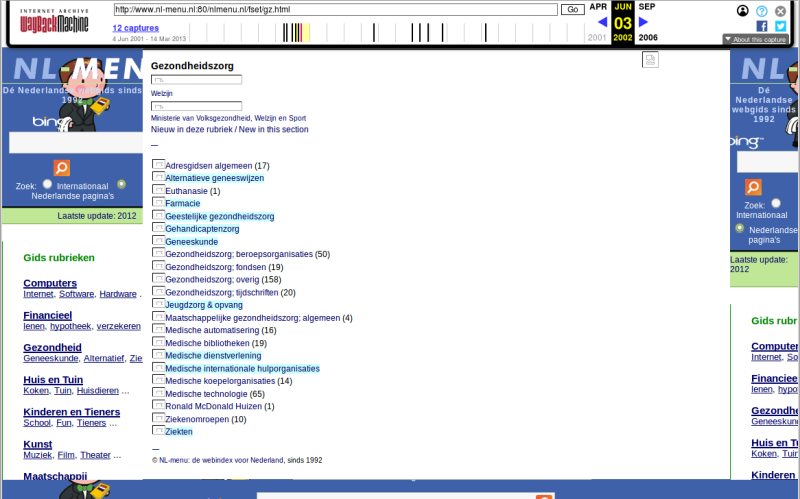
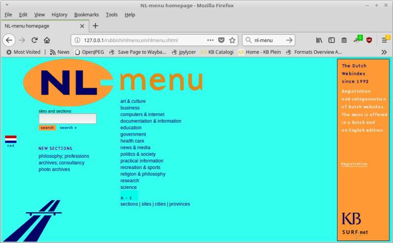

% Eerste Nederlandse webindex gered van CD-ROM

De website *NL-menu* was de eerste Nederlandse webindex. De site is in 1992 opgericht op initiatief van [SURFnet](https://en.wikipedia.org/wiki/SURFnet), de Nederlandse universiteiten en de KB. Vanaf midden jaren '90 werd de site volledig door de KB beheerd. In 2004 [stopte de KB met *NL-menu*](https://www.robcoers.nl/nl-menu-is-straks-niet-meer-leve-nl-menu/), waarna de site offline is gehaald. In 2006 is de domeinnaam *nl-menu.nl* verkocht aan een bedrijf dat de naam gebruikte voor een eigen webindex, die deels was gebaseerd op de oorspronkelijke *NL-menu* site.

Het oorspronkelijke *NL-menu* is intussen in de vergetelheid geraakt. In het webarchief van het [Internet Archive](https://archive.org/) zijn nog wel behoorlijk wat [snapshots van *NL-menu* terug te vinden](https://web.archive.org/web/*/www.nl-menu.nl), maar deze zijn onvolledig, en bovendien niet representatief voor hoe de site er in werkelijkheid uitzag. Zo is [deze pagina](https://web.archive.org/web/20020603232609/http://www.nl-menu.nl:80/nlmenu.nl/fset/gz.html) een snapshot uit juni 2002:

Linksboven is een [*Bing*](https://en.wikipedia.org/wiki/Bing_(search_engine)) zoekvenster te zien, maar omdat *Bing* pas in 2009 is opgericht kan de site er in 2002 onmogelijk uitgezien hebben zoals deze snapshot. De discrepantie is het gevolg van de manier waarop Internet Archive websites binnenhaalt en weergeeft. In dit geval is de pagina in 2002 niet volledig binnengehaald. Enkele ontbrekende elementen (o.a. de linker en rechter menuframes) zijn vervolgens pas 10 jaar later binnengehaald. De weergave van in Internet Archive is hierdoor een soort amalgaam van de pagina op verschillende tijdstippen, die nog maar weinig zegt over hoe de pagina er in werkelijkheid uitzag.

Omdat de KB pas in 2007 is begonnen met webarchivering, is *NL-menu* ook niet te vinden in het [KB Webarchief](https://www.kb.nl/bronnen-zoekwijzers/databanken-mede-gemaakt-door-de-kb/webarchief-kb). Wel zijn er, kort voordat *NL-menu* in 2004 offline werd gehaald, drie CD-ROMs gebrand met daarop de inhoud van de site.

*NL-menu* is van historisch belang, omdat het een unieke bron van informatie is over de (relatief) vroege geschiedenis van het Nederlandse web. We hebben daarom geprobeerd een reconstructie te maken van de site zoals deze er in het begin van 2004 bij lag. Het belangrijkste doel hiervan was om de site met terugwerkende kracht in het webarchief te kunnen opnemen.

## Uitlezen van de CD-ROMs

De eerste stap hierbij was het uitlezen van de data van de CD-ROMs. Een probleem hierbij is dat (zelfgebrande) CD-ROMs bijzonder vergankelijk zijn. Het was dan ook geen verrassing dat *alle* schijfjes in eerste instantie leesfouten opleverden! Hierop hebben we een geprobeerd de schijfjes uit te lezen met een gespecialiseerde data-recovery tool ([*ddrescue*](https://www.gnu.org/software/ddrescue/)). Hiermee lukte het ons om de data van één van de CD-ROMs volledig te redden. Hiervoor was het wel nodig om *ddrescue* meerdere opeenvolgende keren te draaien, met in totaal vier verschillende CD-drives. De overige twee CD-ROMs bleken in een dermate slechte staat te zijn, dat ze voor een reconstructie van *NL-menu* niet meer te gebruiken waren.

## Reconstructie van de website

De uitleesstap leverde een [ISO-image](https://nl.wikipedia.org/wiki/ISO_(bestandsindeling)) op dat een mappenstructuur bevat met alle bestanden van de *NL-menu* site. Voor een reconstructie van de site zoals deze er oorspronkelijk uitzag is nog een extra stap nodig, waarbij de bestanden uitgeleverd worden met een [webserver](https://nl.wikipedia.org/wiki/Webserver). Hiervoor hebben we lokaal op een computer de [Apache webserver](https://nl.wikipedia.org/wiki/Apache_(webserver)) geïnstalleeerd, en een configuratie aangemaakt voor de *NL-menu* mappenstructuur. Resultaat hiervan is een lokaal werkende versie van de site, die geschikt is voor opname in het KB webarchief. Als illustratie is hier de Engelstalige homepage:

## Publiek toegankelijke versie

Omdat het webarchief alleen toegankelijk is vanuit de leeszalen van de KB, hebben we er in dit geval voor gekozen om de gereconstrueerde versie van *NL-menu* ook beschikbaar te stellen vanaf de KB Onderzoekswebsite. Hierbij hebben we wel enkele kleine aanpassingen moeten doen op de originele bestanden. Het gaat hierbij voornamelijk om het updaten van (relatieve en absolute) interne links.

Het resultaat is vanaf de volgende link toegankelijk:

<http://www.kbresearch.nl/nl-menu/>

Een paar kleine dingen om op te letten bij het bekijken van de site:

- Links naar categorieën die sub-categorieën bevatten werken niet goed in Firefox. Workaround: gebruik de rechtermuisknop en open de subcategorie in een nieuwe tab (of zet JavaScript uit). In Chrome/Chromium werken deze links wel.
- Formulieren werken niet vanwege het ontbreken van de daaraan gekoppelde CGI scripts (deze zijn destijds niet op de CD-ROM gezet).
- Op de [colofonpagina](http://www.kbresearch.nl/nl-menu/nl-menu/nlmenu.nl/fset/zoekenplus.html?http://www.kbresearch.nl/nl-menu/nl-menu/nlmenu.nl/admin/colofon.html) is de URL *http://www.kbresearch.nl* te zien, in plaats van de originele *http://www.nl-menu.nl* URL. Dit is een bij-effect van het script dat is gebruikt voor het aanp[assen van interne links.

## Meer informatie

Op de website van de *Open Preservation Foundation* is een (Engelstalige) blogpost met meer gedetailleerde informatie over de reddingspoging van *NL-menu*:

*[Resurrecting the first Dutch web index: NL-menu revisited]()

Meer informatie over webarchivering op de KB:

*[How can we improve our web collection? An evaluation of webarchiving at the KB National Library of the Netherlands (2007-2017)](https://zenodo.org/record/881109)

