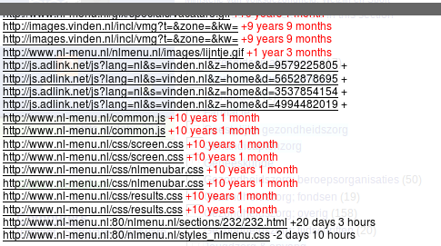
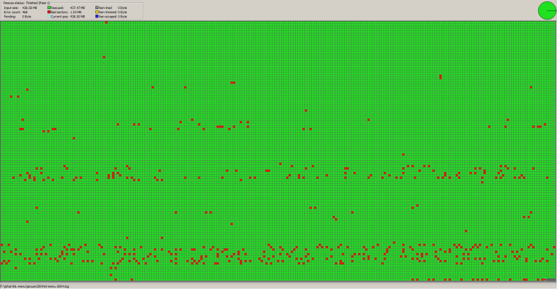
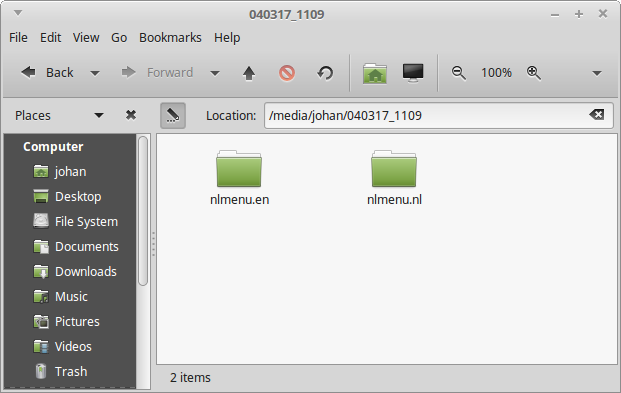
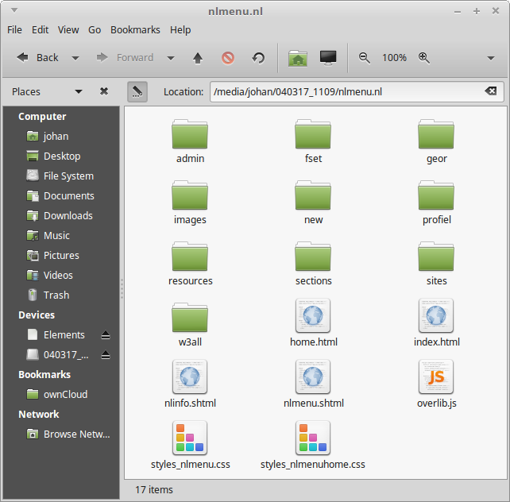
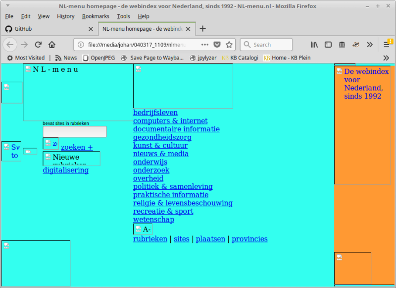

% It's alive! Resurrecting the first Dutch web index from CD-ROM

*NL-menu* was the first Dutch web index. The site was originally founded by a consortium of [SURFnet](https://en.wikipedia.org/wiki/SURFnet), Dutch universities and the  KB. From the mid-nineties onwards it was maintained solely by the KB. *NL-menu* was [discontinued in 2004](https://www.robcoers.nl/nl-menu-is-straks-niet-meer-leve-nl-menu/), after which the site was taken offline. In 2006 the domain name was sold to a private company that used it for hosting a web index that was partially based on the original *NL-menu* site.

Meanwile, the original *NL-menu* has been largely lost to the mists of time. Even though the Internet Archive's Wayback Machine contains [rather a lot of snapshots of the site](https://web.archive.org/web/*/www.nl-menu.nl), these are incomplete, and don't capture the original look and feel. For example, [this page](https://web.archive.org/web/20020603232609/http://www.nl-menu.nl:80/nlmenu.nl/fset/gz.html) is a snapshot from June 2002:

However, this doesn't look even remotely like the site as it was in 2002. Just for one thing, at the top-left we see a [*Bing*](https://en.wikipedia.org/wiki/Bing_(search_engine)) search box, but *Bing* didn't even exist until 2009! An inspection of the crawl time stamps (these can be seen by clicking on the top-right *About this capture* button) reveals that this "snapshot" is really an amalgam of elements that were crawled at wildly varying dates, some as recently as 2018:

*NL-menu* is not part of the [KB Web Archive](https://www.kb.nl/en/organisation/research-expertise/long-term-usability-of-digital-resources/web-archiving), as the KB only started its web archiving activities in 2007. The only remaining "complete" copies of *NL-menu* are three (recordable) CD-ROMs that were burned shortly before the site was taken offline in 2004.

As *NL-menu* is a unique source of information about the (relatively) early history of the Dutch Internet, we made an attempt at reconstructing the site as it appeared in early 2004. This involved the following steps:

1. Recover the data from the remaining CD-ROMs
2. Set up a local copy of the site by serving the recovered data om a webserver
3. Crawl the recovered site for inclusion in our web archive

The remainder of this blog describes how we went about the first two steps.

## Recovering the data

A first attempt at viewing the contents of the CD-ROMs in a file manager resulted in read errors for *all* discs. This is not surprising, given the instability of CD-Rs, and the fact these discs were burned in early 2004. So, we tried to recover the contents of the discs with the dedicated data-recovery tool [*ddrescue*](https://www.gnu.org/software/ddrescue/). We used the following command line:

    ddrescue -d -b 2048 -r4 -v /dev/sr0 NL-menu-ddrescue.iso NL-menu-ddrescue.log

Here *-d* tells *ddrescue* to read the disc using direct disc access mode, *-b* sets the block size (which is 2048 bytes for a CD-ROM); *-r4* sets the maximum number of retries in case of bad sectors to 4, and *-v* activates verbose output mode. File *NL-menu-ddrescue.iso* is the image file with the recovered data; *NL-menu-ddrescue.log* is a so-called [*mapfile*](https://www.gnu.org/software/ddrescue/manual/ddrescue_manual.html#Mapfile-structure), which holds information on the recovery status of blocks of data.

One of the advantages of *ddrescue* is that it can be run multiple consecutive times for each disc, using different optical drives if necessary. This is extremely useful, as it is not uncommon to find that some sectors on a disc result in read errors on one drive, whereas those sectors are read without problems by another drive (and vice versa).

## Results of recovery process

Out of the three CD-ROMs, only one copy could be fully recovered without any unreadable sectors. The recovery process required multiple passes with *ddrescue*, using two computers and four different optical drives (two internal drives, and two external USB drives).

Only half of the second disc could be recovered after a 16-hour recovery pass with *ddrescue*. An inspection of the resulting ISO image in a hex editor showed the recovered sectors of this disc to be byte-identical to the first disc (which was recovered in full). Having established this, we didn't do any further attempts at recovering more data from this disc (since it is simply a copy of the first disc).

For the third disc, 99.8% of the data could be recovered after four rounds with *ddrescue* with four optical drives. Below image shows a visualisation of the recovery process (made with [*ddrescueview*](https://sourceforge.net/projects/ddrescueview/)):

Here, each block respresents one 2048-byte sector, where a red block is a sector with read errors. In this case 468 sectors spread across the disc are unreadable. This means that any files or folder definitions that occupy any of those sectors will be damaged. The resulting ISO image turned out to be readable, but one of the top-level directories (which contains half of the files on the disc) is not shown when the image is mounted or opened in an archive manager. So, we discarded this ISO image from any further processing as well. Unfortunately this disc did *not* turn out to be merely a copy of the first disc.

## Inspecting the contents of the ISO image

After mounting the ISO image of the first disc (i.e. the one that was recovered without errors) on a Linux machine, the following directory structure appears:

The *nlmenu.nl* directory contains the Dutch-language version of the site, and *nlmenu.en* the English-language version (oddly, there's no top-level index page!). Here are the contents of the *nlmenu.nl* directory:

If we open *index.html* in a browser (Firefox) we see this:

We can see here that several images are not rendered; also none of the (internal) hyperlinks work. This happens because all file paths in the underlying HTML are defined relative to the site's root directory, and these don't resolve properly on the local file system. In order to render the site correctly we have to serve it from a locally installed web server.

## Serving the CD-ROM contents with a web server

So, we installed the [*Apache web* server](https://en.wikipedia.org/wiki/Apache_HTTP_Server) on a Linux machine, and then configured it to serve the unpacked contents of the ISO image. More details on how we did this can be found in [these technical notes](https://github.com/KBNLresearch/nl-menu-resources/blob/master/doc/serving-static-website-with-Apache.md). This allowed us to render the English-language version the site on [localhost](https://en.wikipedia.org/wiki/Localhost):

Oddly, loading the Dutch-language version would immediately redirect the browser to the old 'live' web address at <http://www.nl-menu.nl/>. An inspection of the HTML revealed that this was due to some JavaScript:

    

Digging deeper, we found similar JavaScript in other pages of the site. Although disabling JavaScript in the browser prevents the redirects from happening, this is a crude workaround at best. It *is* possible to re-write the URLs in the offending JavaScript prior to crawling the site, but that would raise some serious concerns about authenticity. So, this is something we still need to think about before crawling the recovered site for inclusion in our web archive. On a related note, somehow we will have to record that our archival snapshot was take from a locally reconstructed copy, rather than the original site. We'd be interested to hear how other web archives are dealing with these issues.

## Publicly available version of the recovered site

The KB web archive is only accessible on-site in our reading rooms. Since the KB owns the rights to *NL-menu*, we decided to make the reconstructed site available on the KB Research website. In order to make this work, we applied a couple of small changes to the original files:

* Relative references to website resources were re-written to reflect the location of the site on the kbresearch domain.
* All references to the original *nl-menu.nl* domain were updated to the *kbrearch.nl* domain (most importantly this prevents redirects to the original *nl-menu.nl* domain, as explained above).
* The Dutch index page was copied to the site root, so that it's used as a top-level index (this was done because the CD-ROM has no top-level index page).

The above changes were all made using this [script](https://github.com/KBNLresearch/nl-menu-resources/blob/master/scripts/fixhtml.sh).

The result of all this is available here:

<http://www.kbresearch.nl/nl-menu/nl-menu/>

This reflects the state of *NL-menu* briefly before it closed down in 2004.

Although at first glance the reconstructed site appears to be of much better quality than any of the available Wayback snaphots, there are a couple of caveats:

- Links to categories that contain sub categories don't work in Firefox. A workaround is to right-click on the link and open it in a new tab (or disable JavaScript). In Chrome/Chromium these links work normally.
- The site contains a number of forms that don't work because the associated CGI scripts are missing (these scripts are not on the CD-ROM).
- Some pages show the URL *http://www.kbresearch.nl*, instead of the original *http://www.nl-menu.nl*. This is an unintended side-effect of the script that was used to update the links.

There may be more issues; please feel free to contact us if you spot anything that doesn't look quite right!

## Acknowledgements

Thanks are due to the folllowing people for their advice and suggestions: Annemarie Beunen, Willem Jan Faber, Kees Teszelszky, and Lammert Zwaagstra.

## Additional resources

* [NL-menu (2004 snapshot at kbresearch.nl)](http://www.kbresearch.nl/nl-menu/nl-menu/)
* [Serving a static website with the Apache web server (technical notes)](https://github.com/KBNLresearch/nl-menu-resources/blob/master/doc/serving-static-website-with-Apache.md)
* [How can we improve our web collection? An evaluation of web archiving at the KB National Library of the Netherlands (2007-2017)](https://zenodo.org/record/881109)
