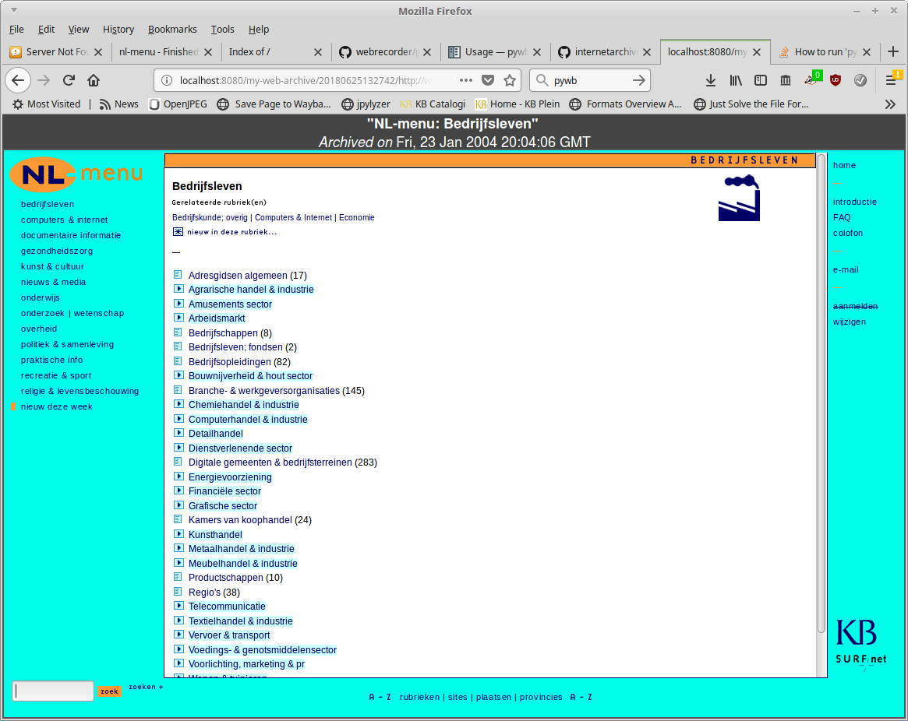

# Crawl website to WARC

## Scope

These notes describe:

- how to crawl a website that is hosted on localhost to a WARC file
- how to test the resulting WARC

These notes only cover static HTML-based sites, and not dynamic sites that depend on a full [*LAMP stack*](https://en.wikipedia.org/wiki/LAMP_(software_bundle))).

## Earlier work

These notes build on [earlier documentation by Jeroen van Luin of the National Archives of the Netherlands](http://docplayer.nl/17762647-Ervaringen-met-website-archivering-in-het-nationaal-archief.html). This document lists two methods for crawling from localhost:

1. Crawl using [Heritrix](https://github.com/internetarchive/heritrix3)
2. Crawl using [Wget](https://www.gnu.org/software/wget/)

Initial tests with Heritrix (build heritrix-3.3.0-20180529.100446-105) resulted in several problems. Most importantly, Heritrix appeared to ignore the *hosts* file, with the effect that it would  (elements of) the "live" site at the crawl domain, instead of localhost. After disabling network access, crawl jobs would run indefinitely without ever downloading any actual data. Because of this I gave up on Heritrix, and focused mostly on Wget. I also did some limited tests with [Warcit](https://github.com/webrecorder/warcit) tool, which is a relatively new tool that is part of the [Webrecorder](https://github.com/webrecorder) suite. 

## Preparation: change machine system date, disable network connection

In most cases it will be desirable that the site snapshot will appear in the Wayback timeline around the year/date it was actually online. This can be achieved by setting the computer's system date to that date. This has to be done before running wget. Below is an example:

    sudo date --set="2004-01-23 21:03:09.000"

Also, to completely rule out anything from the "live" web leaking into the crawl, it may be prudent to disable the network connection at this point (both wired and wireless connections!).

## Wget: basic command

The basic command line for crawling the site (hosted locally at URL `http://www.nl-menu.nl/`) is[^1]: 

    wget --mirror \
        --page-requisites \
        --adjust-extension \
        --warc-file="nl-menu" \
        --warc-cdx \
        --output-file="nl-menu.log" \
        http://www.nl-menu.nl/

This results in a WARC file, a CDX index file (useful for subsequent quality checks), a log file and a mirror of the crawled directory tree (which again is useful for quality checks).

This results in a 200 MB compressed WARC file, which can be rendered in [pywb](https://github.com/webrecorder/pywb). However, a [detailed analysis shows that over 660 files from the source directory tree are missing in the crawl](./qa-archived-site.md). For most of these (90%), the explanation for their absence is that they are not referenced (by way of a hyperlink) by any of the website resources that are crawled from the site root. Of the remaining 64 missing files, 51 are only referenced through a JavaScript variable (which are understandably not recognised by wget). Other, less common reasons are:

- File is only referenced as *value* attribute of an *input* element:
- File is only referenced frame *src* attribute of a *frame* element

So, I tried adapt the basic command above to get a more complete capture.

## Wget: use --input-file switch

Wget's `--input-file` switch take a list of URLs which are sequentially crawled. In theory this would allow one to force the inclusion of all files in the crawl. The first step here is to create a directory listing of the source directory of the website, and then transform each file entry into a corresponding URL. I did this using the command below: 

    find /var/www/www.nl-menu.nl -type f \
        | sed -e 's/\/var\/www\//http:\/\//g' > urls.txt

I then ran wget with the command below (note that I removed the `--mirror` option, as this caused wget to do a recursive crawl *for each single URL* in the list, which takes forever):

    wget --page-requisites \
        --warc-file="nl-menu" \
        --warc-cdx \
        --output-file="nl-menu.log" \
        --input-file=urls.txt

This results in a WARC file that contains *all* files from the source directory. But it does introduce a different problem: when the WARC is accessed using pywb, it shows up as 85864 individual captures (i.e. each file appears to be treated as an individual capture)! This makes rendering of the WARC impossible (loading the list of capture alone takes forever to begin with). Right now it is unclear whether this behaviour is caused by the WARC, or by pywb[^2]. 

## Wget: list of URLs as HTML crawl root

So as a last resort did the following hack, where I created a list of all URLs in HTML format, and then put that file in the site's source directory. Steps:

1. Create list of URLS in Markdown format (add "\<" and "\>" pre-and suffix to each line):

    `find /var/www/www.nl-menu.nl -type f | sed -e 's/\/var\/www\//<http:\/\//; s/$/>\n/g' > urls.txt`

2. Replace any whitespace characters with *%20* to avoid malformed URLs:

    `sed -i 's/\ /%20/g' urls.txt`

3. Convert URL list to HTML (using Pandoc) which is placed at the root directory of the source dir:

    `sudo pandoc -s urls.txt -o /var/www/www.nl-menu.nl/urls.html`

Then I ran wget, using the above URL list as crawl root:

    wget --mirror \
        --page-requisites \
        --warc-file="nl-menu" \
        --warc-cdx \
        --output-file="nl-menu.log" \
        http://www.nl-menu.nl/urls.html

The resulting WARC contains all files that are in the source dir, and it can be accessed as one single capture in pywb. The obvious downside of this hack is that it compromises the integrity of the 'original' website by adding one (huge) HTML file that was not part of the original site to the WARC.

## Warcit

    warcit http://www.nl-menu.nl/ /var/www/www.nl-menu.nl/ -d 20040123200500

Result:

    [INFO] Wrote 85646 resources to www.nl-menu.nl.warc.gz

## Rendering the archived site locally

Install [pywb](https://github.com/webrecorder/pywb):

    sudo python3 -m pip install pywb

Set up test directory:

    mkdir test-pywb
    cd test-pywb

Create archive:

    wb-manager init my-web-archive

Add NL-menu WARC:

    wb-manager add my-web-archive /home/johan/NL-menu/warc-wget/nl-menu.warc.gz

Start the server:

    wayback

Archived site is now available from:

<http://localhost:8080/my-web-archive/20040123201017/http://www.nl-menu.nl/>

Result:

Which appears to work fine!

A more or less elaborate [Quality assessment of the archived site can be found here](./qa-archived-site.md)

## Additional resources

- Jeroen van Luin: [Ervaringen met website-archivering in het Nationaal Archief](http://docplayer.nl/17762647-Ervaringen-met-website-archivering-in-het-nationaal-archief.html)

[^1]: Compared to van Luin's example, this leaves out the *-w* switch (since we are crawling from a local machine, overloading the host server is not an issue, so we can crawl at maximum speed), the *-k* switch (converting the links is not necessary for rendering the site) and the *-E* switch (I don't think changing any extensions is really necessary or desired in this case, but I could be wrong?). It also adds the *--warc-cdx* command (which writes an index file) and the *--output-file* switch (which writes a log file)

[^2]: It is worth pointing out that if the automatically-built index file of the first (rendering/1-capture) WARC is replaced by an index that is produced by pywb's cdx-indexer tool (command: `cdx-indexer -j -s /home/johan/test-pywb/collections/my-web-archive/indexes/index.cdxj /home/johan/test-pywb/collections/my-web-archive/archive/nl-menu.warc.gz`), that WARC subsequently also shows up as 85864 captures. This suggests the index file might be the culprit for the other problematic WARCs.
