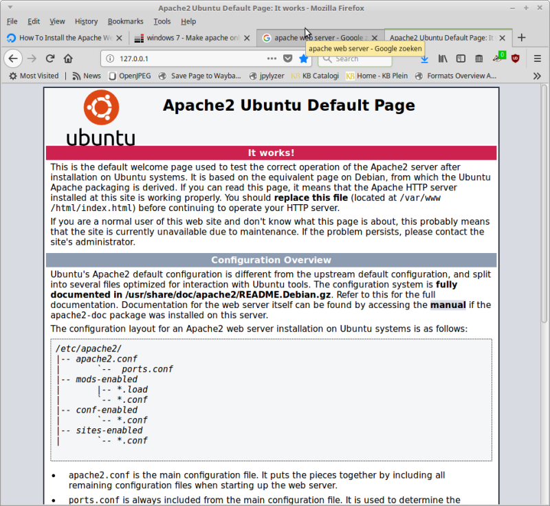
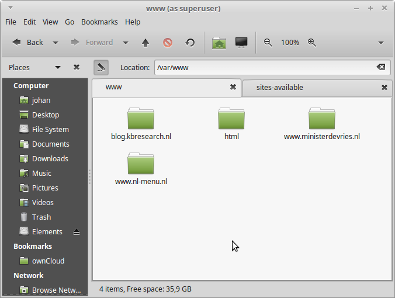
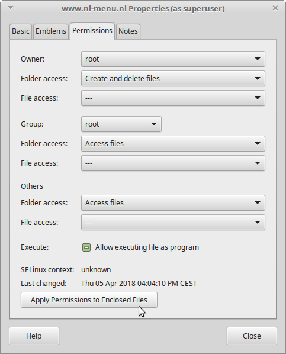
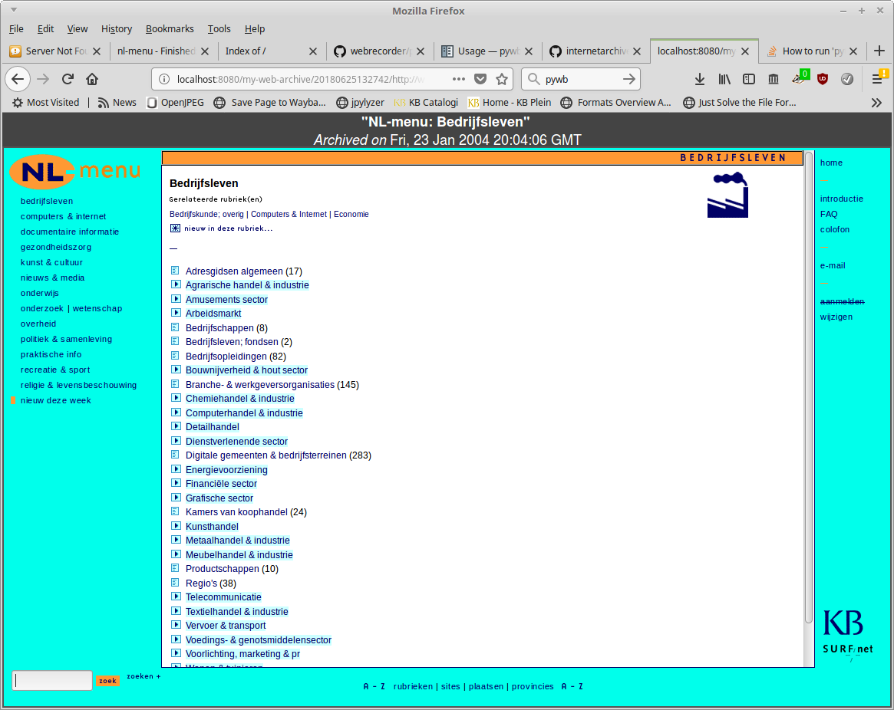

# Serving a static website with the Apache web server

## Scope

These notes cover the very basics of:

- how to set up the Apache web server
- how to restrict access to localhost
- how to install a site (for example from a static CD-ROM dump)
- how to crawl the site so it can be ingested into a web archive
- how to test the resulting WARC

These notes are based on Apache/2.4.18 on a Linux-based system. They only cover static HTML-based sites. Serving dynamic sites also requires an additional application server and a database (i.e. a full [*LAMP stack*](https://en.wikipedia.org/wiki/LAMP_(software_bundle))).

**!!Important!!** use these notes at your own risk! I'm not an expert on neither web server nor Apache, and these are primarily for my own reference!

## Installation of Apache web server

First update the package index:

    sudo apt-get update

Then install Apache:

    sudo apt-get install apache2

Configuration directory is `/etc/apache2`. Note that the server starts running directly after installation.

## Restrict access to localhost

Running a web server can expose your machine to a number of security threats, so it's a good idea to restrict access to localhost only (this means that only the machine on which the server is running can access it). To do this, locate the file *ports.conf* in the *Apache* configuration directory (`/etc/apache2`), open it in a text editor (as sudo), and then change this line:

    Listen 80

into this:

    Listen 127.0.0.1:80

Save the *ports.conf* file, and restart the web server using:

    sudo systemctl restart apache2

## Check if the server is running

Type the following command:

    sudo systemctl status apache2

Output should be something like this:

    ● apache2.service - LSB: Apache2 web server
       Loaded: loaded (/etc/init.d/apache2; bad; vendor preset: enabled)
      Drop-In: /lib/systemd/system/apache2.service.d
               └─apache2-systemd.conf
       Active: active (running) since Tue 2018-04-10 12:40:29 CEST; 3min 21s ago
         Docs: man:systemd-sysv-generator(8)
      Process: 7756 ExecStop=/etc/init.d/apache2 stop (code=exited, status=0/SUCCESS)
      Process: 5731 ExecReload=/etc/init.d/apache2 reload (code=exited, status=0/SUCCESS)
      Process: 7779 ExecStart=/etc/init.d/apache2 start (code=exited, status=0/SUCCESS)
       CGroup: /system.slice/apache2.service
               ├─7796 /usr/sbin/apache2 -k start
               ├─7799 /usr/sbin/apache2 -k start
               └─7800 /usr/sbin/apache2 -k start

    Apr 10 12:40:28 johan-HP-ProBook-640-G1 systemd[1]: Starting LSB: Apache2 web server...
    Apr 10 12:40:28 johan-HP-ProBook-640-G1 apache2[7779]:  * Starting Apache httpd web server apache2
    Apr 10 12:40:28 johan-HP-ProBook-640-G1 apache2[7779]: AH00558: apache2: Could not reliably determine the server's fully qualified domain name, using 127.0.1.1. Set the 'ServerName' directive globally to suppress this message
    Apr 10 12:40:29 johan-HP-ProBook-640-G1 apache2[7779]:  *
    Apr 10 12:40:29 johan-HP-ProBook-640-G1 systemd[1]: Started LSB: Apache2 web server.

Finally open below URL in your web browser:

<http://127.0.0.1/>

If all goes well this should load the Apache default page:

## Adding a site

Adding a site involves the following steps:

1. Put the site contents somewhere on the file system (by default in a subdirectory of folder `/var/www`, although any directory can be used).
2. Create a configuration file under `/etc/apache2/sites-available`
3. Activate the configuration file
4. Add original domain to hosts file
5. Restart the server.

### 1. Put site contents on the file system

Create a root directory for your site under `/var/www` (you need sudo rights for this). For example, in below screenshot `var/www` contains 4 different sites:

Next copy the contents of your site into this directory. Make sure to check the file permissions for the top-level folders; for all users (Others), *Folder Access*  must be set to *Access Files*. Apply these permissions to all underlying (enclosed) files as well. In the Caja file manager (Ubuntu / Linux Mint MATE desktop) this looks as follows:

You can also set the permissions from the terminal, using the following commands:

    sudo find www.nl-menu.nl -type d -exec chmod 755 {} \;
    sudo find www.nl-menu.nl -type f -exec chmod 644 {} \;

### 2. Create a configuration file

Next you need to create a configuration file for the site `/etc/apache2/sites-available`. The easiest way to do this is to copy an existing file (typically the default *000-default.conf*), and save it under a new name (e.g. *nl-menu.conf*). Note that you need sudo priviliges for this. Then open the newly created file in a text editor (again as sudo), and edit the value of the *DocumentRoot* variable, which must point to the root directory of your site. For example, if our site is located at `/var/www/www.nl-menu.nl` use this:

    DocumentRoot /var/www/www.nl-menu.nl

Then save the file.

### 3. Activate the configuration file

First disable the current configuration (in this case 8000-default.conf*):

    sudo a2dissite 000-default.conf

Now enable the new one:

    sudo a2ensite nl-menu.conf

### 4. Add original domain to hosts file

Open (with sudo priviliges) file `/etc/hosts` in a text editor, and add a line that associates the IP address at which the site is locally available to its original URL. For example:

    127.0.0.1	www.nl-menu.nl

Then save the file.

### 5. Restart the server

Type this:

    sudo systemctl restart apache2

All done! The newly installed site is now available at the original URL in your web browser:

<http://www.nl-menu.nl> (which should redirect to <http://127.0.0.1/>)

## Crawl the site for use in web archive

### Preparation: change machine system date to approximate date of snapshot

    sudo date --set="2004-01-23 21:03:09.000"

Two methods listed in [van Luin](http://docplayer.nl/17762647-Ervaringen-met-website-archivering-in-het-nationaal-archief.html):

1. Heritrix
2. Wget

### Heritrix

Installed Heritrix 3.3. 0 (build heritrix-3.3.0-20180529.100446-105). For some reason Heritrix appears to ignore the domain to hosts file, crawling (some elements of) the "live" site instead. If I disable network acesss, the crawl job runs indefinitely without ever downloading any actual data. Tried this for several seed URLs, such as:

    http://www.nl-menu.nl/nlmenu.nl/

and

    http://www.nl-menu.nl/nlmenu.nl/nlmenu.shtml

These all give the same result. So I gave up on this and moved to the wget method below.

## Wget

To completely rule out anything from the "live" site leaking into the crawl, I disabled the network connection before starting the crawl. I then ran Wget following the example in van Luin (minus the `-w` parameter, which is not needed when crawling from our own local machine):

    wget -m -k -p -E --warc-file="NL-menu" http://www.nl-menu.nl/nlmenu.nl/nlmenu.shtml &>wget_stdout_stderr.txt

This results in a 200 MB compressed WARC file. Throwing WARC at [warctools](https://github.com/internetarchive/warctools)' *warcvalid* doesn't result in any errors.

## Testing the archived site

Install [pywb](https://github.com/webrecorder/pywb):

    sudo python3 -m pip install pywb

Set up test directory:

    mkdir test-pywb
    cd test-pywb

Create archive:

    wb-manager init my-web-archive

Add NL-menu WARC:

    wb-manager add my-web-archive /home/johan/NL-menu/warc-wget/NL-menu.warc.gz

Start the server:

    wayback

Archived site is now available from:

<http://localhost:8080/my-web-archive/20180625132742/http://www.nl-menu.nl/>

Result:

Which appears to work fine!

## Comparison with files extracted from ISO image

- ISO image: 86567 items, totalling 490,4 MB
- Scraped by wget: 85891 items, totalling 432,5 MB

Difference: 671 items (files and/or folders), 57.9 MB!

Detailed comparison:

    diff --brief -r /home/johan/NL-menu/cd1-intact/NL-menu/ /home/johan/NL-menu/warc-wget/www.nl-menu.nl/ | grep "Only in /home/johan/NL-menu/cd1-intact/NL-menu" > diffdir.txt

Result [here](./diffdir.txt). In particular, the following items are missing in the wget crawled version:

- 499 .gif files
- 83 .html files
- 36 .txt files

Not entirely clear why this happens, could be orphaned resources that are not referenced by the site.

## Additional resources

* [Apache HTTP Server Documentation](https://httpd.apache.org/docs/)
* [How To Install the Apache Web Server on Ubuntu 16.04](https://www.digitalocean.com/community/tutorials/how-to-install-the-apache-web-server-on-ubuntu-16-04)
* [Make apache only accessible via 127.0.0.1](https://serverfault.com/questions/276963/make-apache-only-accessible-via-127-0-0-1-is-this-possible/276968#276968)
* Jeroen van Luin: [Ervaringen met website-archivering in het Nationaal Archief](http://docplayer.nl/17762647-Ervaringen-met-website-archivering-in-het-nationaal-archief.html)